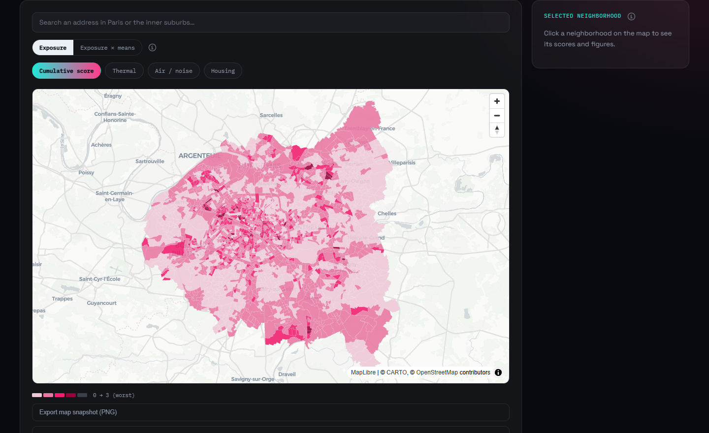

# Underlaid

**Where environmental exposures overlap in Paris and its inner suburbs —
and who has the means to cope with them.** For each of 2,752
neighborhoods (INSEE IRIS), Underlaid counts how many of three exposures
— heat, air/noise pollution, energy-inefficient housing — are
*simultaneously* in their worst quartile, and sets that count beside
residents' means to cope. Built entirely from public open
data; every formula documented.



**[Open the map](https://underlaid.vercel.app)** ·
[Methodology](https://underlaid.vercel.app/methodology) ·
[Ranking](https://underlaid.vercel.app/ranking) ·
[Press kit](https://underlaid.vercel.app/press) ·
[Version française](https://underlaid.vercel.app/fr)

**What it measures / doesn't**
- ✅ **Exposure**: a count (0-3) of categories in their metro-wide worst quartile — never a smoothed average.
- ✅ **Means to cope**, on a *separate* axis: median income, overcrowded homes, secondary residences (INSEE 2021) — crossed with exposure on the map, never added to the score.
- ❌ Not sensitivity (age, health), not what households actually do (air conditioning, time off), not flood, soil or industrial risk (yet). Access to services is shown for information only — no indicator measures it reliably yet ([why](SCORING.md#why-access-to-services-left-the-score)).
- ❌ Not an accusation: it shows where exposures stack up, not why, and names no one as the cause.

**Key figures** (2,752 IRIS, data snapshot of October 1, 2026 — the score
moves with every pipeline run):

| Score | 0 | 1 | 2 | 3 |
|---|---|---|---|---|
| IRIS | 1,122 (40.8%) | 1,216 (44.2%) | 382 (13.9%) | 32 (1.2%) |

**What crossing exposure with means shows** (2,529 IRIS with published
income):
- **Not the same exposures.** Highly exposed neighborhoods (2 or 3 of 3)
  with the *highest* means are mostly in Paris (193 of 236) and stack
  **heat and old, inefficient housing** (worst quartile in 92% and 94% of
  them). Those with the *lowest* means are mostly in Seine-Saint-Denis
  and Val-de-Marne and stack **heat and air/noise pollution** (88% and
  86%).
- **Overall, the link between exposure and means is weak** (Spearman
  +0.28), and slightly positive only because of dense, older central
  Paris (+0.39 within Paris); in the three inner-suburb departments
  there's almost no link.
- **Where high exposure and low means meet, it's concentrated**: in
  Seine-Saint-Denis, 76% of the highly exposed neighborhoods are in the
  metro area's lowest third of means; in Paris, 2%.

---

## About this repository

Interactive mapping tool revealing, per IRIS zone, the cumulative overlap
of several environmental exposures (heat, air/noise, access to services,
socio-economic segregation, housing), with a breakdown by factor. Modeled
on EJScreen/CalEnviroScreen/EJNYC — never done for Paris (and, as of
Phase 5, its inner-ring suburbs) at IRIS granularity before.

Covers the full Métropole du Grand Paris "Petite Couronne": Paris (75)
plus Hauts-de-Seine (92), Seine-Saint-Denis (93) and Val-de-Marne (94) —
**2,752 IRIS zones**. Originally shipped as a Paris-intra-muros MVP (992
IRIS); see "Expanding beyond Paris" in [SCORING.md](SCORING.md) for what
changed and why.

## Context

The closest regional precedent: **ORS Île-de-France / Ineris / L'Institut
Paris Region, "Cumuls d'expositions environnementales en Île-de-France"
(2022)** — a 5-year, 500m-grid study of composite environmental exposure
across the whole region, with a public interactive map
([cartoviz.institutparisregion.fr](https://cartoviz.institutparisregion.fr))
and a case study on Aubervilliers, a commune inside Underlaid's own MGP
coverage. Same core idea (composite exposure, not a single blended index);
Underlaid's difference is IRIS-level granularity and a cumulative
worst-quartile count rather than a coarser, non-cumulative grid score.

A comparable tool already exists: **[Adapt'Canicules](https://adaptaville.fr)**
(RésO Villes, 137 agglomerations, focused on QPV priority neighborhoods,
built on 200m gridded data). Underlaid's differentiation: **IRIS-level**
granularity (finer than QPV), an **interactive public-facing** map rather
than an institutional report, and a **cumulative** metric rather than a
smoothed average.

This project is anchored in an active policy debate: the Haut Conseil
pour le Climat's July 9, 2026 report ("France isn't ready", coining
"bouilloires thermiques" — thermal kettles), the ongoing discussion around
a "service public de la fraîcheur" (public cooling service), and the
Fonds Vert budget cut (€2.5bn → €837M).

The score is meant to stay **descriptive, never accusatory**: it shows
the correlation between income and exposure without asserting intent
behind it. It's named a **cumulative environmental exposure score**,
not a "vulnerability score" — in climate science, vulnerability is
exposure + sensitivity + adaptive capacity together. The score measures
exposure only; adaptive capacity is measured on its own, separate axis
(the map's "Exposure × means" view) and never folded into it — see
SCORING.md's "What this score doesn't measure" and "Adaptive capacity —
a separate axis".

## Step 1 — Data

Every script in `scripts/` downloads and normalizes one source into
`data/processed/*_iris.geojson`, each carrying a `code_iris` column
(9-digit INSEE IRIS code) as the common join key.

`scripts/01_iris_contours.py` must run first: it produces
`data/processed/iris_mgp.geojson`, the geometric reference every other
script joins against. All scripts have been run end-to-end and validated
against the full Métropole du Grand Paris "Petite Couronne" (2,752 IRIS
zones across Paris + Hauts-de-Seine + Seine-Saint-Denis + Val-de-Marne).

### Sources

| Script | Output | Source |
|---|---|---|
| `01_iris_contours.py` | `iris_mgp.geojson` | data.iledefrance.fr — IGN & INSEE, IRIS 2024 edition, filtered to depts 75/92/93/94 |
| `02_icu_sat4bdnb.py` | `icu_iris.geojson` | data.gouv.fr / CSTB — Sat4BDNB urban heat island indicators |
| `03_cool_spots_facilities.py` | `cool_spots_facilities_iris.geojson` | INSEE BPE (reused from script 06), pools/museums/libraries (F101/F305/F307) — re-sourced from `opendata.paris.fr` in Phase 5 for MGP-wide uniformity |
| `04_cool_spots_green_areas.py` | `cool_spots_green_iris.geojson` | data.iledefrance.fr — open/publicly-accessible green & wooded space, region-wide — re-sourced from `opendata.paris.fr` in Phase 5 |
| `05_air_noise.py` | `air_noise_iris.geojson` | bruitparif.fr — Airparif/Bruitparif air-noise co-exposure map |
| `06_bpe.py` | `bpe_iris.geojson` | INSEE — Base Permanente des Équipements (BPE), health/education/transport domains |
| `07_equipment_access_200m.py` | `equipment_access_iris.geojson` | data.gouv.fr — access time to equipment, 200m grid (unscored context since the v0 launch, like scripts 09, 12, 15) |
| `08_income_filosofi.py` | `income_iris.geojson` | INSEE Filosofi — median disposable income, 2021 |
| `09_social_index_schools.py` | `social_index_iris.geojson` | data.education.gouv.fr — social position index (IPS), primary/middle schools |
| `10_energy_performance.py` | `energy_performance_iris.geojson` | data.ademe.fr — DPE, share of F/G-rated housing |
| `12_accessibility_erp.py` | `accessibility_iris.geojson` | Acceslibre (data.gouv.fr) — PMR accessibility of ERPs |
| `13_street_lighting.py` | `street_lighting_iris.geojson` | opendata.paris.fr — street lighting density (Paris only — no MGP-wide equivalent) |
| `14_qpv_boundaries.py` | `qpv_boundaries_mgp.geojson` | data.iledefrance.fr — QPV priority-neighborhood boundaries, MGP-wide (validation layer, not scored) |
| `15_pedestrian_paths.py` | `pedestrian_paths_iris.geojson` | OpenStreetMap (Overpass API) — footway density |
| `16_school_ac_context.py` | `school_ac_context_arrondissement.geojson` | press/mairie communications, 2026 heatwave — air-conditioned schools (context only, Paris arrondissement grain only, not scored) |
| `17_enedis_thermosensitivity.py` | `enedis_thermosensitivity_iris.geojson` | opendata.enedis.fr — residential electrical thermosensitivity (winter heating load), second housing sub-score indicator alongside DPE |
| `18_tree_age_context.py` | `tree_age_context_arrondissement.geojson` | opendata.paris.fr — average street-tree trunk circumference (age proxy, no planting-date field exists) and young-tree share, Paris arrondissement grain only, context only, not scored |
| `19_street_lighting_context.py` | `street_lighting_context_arrondissement.geojson` | opendata.paris.fr — street lamp density per km² (area-weighted), Paris arrondissement grain only, context only, not scored |
| `20_associational_density_context.py` | `associational_density_context_commune.geojson` | data.iledefrance.fr — active-association density (RNA), per km² and per 1,000 residents, MGP-wide **commune** grain (143 communes, widened from 20 Paris arrondissements in Phase 5), context only, not scored |
| `21_population_iris.py` | `population_iris.geojson` | INSEE Recensement de la population 2021 — municipal population per IRIS, same vintage as Filosofi; used to normalize raw counts into per-1,000-resident rates |
| `22_artificialization_mos.py` | `artificialization_iris.geojson` | data.iledefrance.fr — MOS (Mode d'Occupation du Sol) land use, % of IRIS area artificialized/sealed; 4th thermal sub-score indicator, substituted for IGN's OCS GE (no accessible vector API — see SCORING.md) |
| `24_secondary_residences.py` | `secondary_residences_iris.geojson` | INSEE Recensement de la population 2021 ("base infra-communale logement") — share of housing units that are secondary residences or occasional dwellings, same vintage as Filosofi/population; one of the 3 indicators of the separate adaptive-capacity axis (script 26), never part of the exposure score — see SCORING.md |
| `25_overcrowding.py` | `overcrowding_iris.geojson` | INSEE Recensement 2021 ("base infra-communale logement", same file as script 24) — share of overcrowded main residences, INSEE definition (`C21_RP_HSTU1P_SUROCC`); adaptive-capacity indicator, never scored |
| `26_adaptive_capacity.py` | `adaptive_capacity_iris.json` | Derived — adaptive-capacity index (mean percentile rank of median income, overcrowding, secondary residences), its tertile, and the exposure × means bivariate class. **Separate file, never an input to the exposure score** — see SCORING.md "Adaptive capacity — a separate axis" |

### Things worth knowing before re-running these scripts

- **`06_bpe.py`** auto-downloads `BPE25.zip` (136 MB, all of France) from
  the stable URL pattern `insee.fr/fr/statistiques/fichier/8217525/
  BPE25.zip`, then filters to the 4 MGP departments (`DEPCOM[:2] in
  ("75","92","93","94")`) while reading the CSV in chunks (the file is
  too large to comfortably hold whole-France in memory). This URL will
  need updating (`BPE25.zip` → `BPE26.zip`, new page id) whenever INSEE
  ships a new edition.
- **`07_equipment_access_200m.py`**: turned out simpler at MGP scale than
  expected — `depcom` is a normal 5-digit INSEE commune code even for
  Paris's legacy single-commune code, so a plain
  `depcom.str[:2].isin(MGP_DEP_CODES)` filter covers every department
  uniformly (the earlier Paris-only version special-cased `75056`
  explicitly; that's gone now, not needed).
- **`08_income_filosofi.py`**: INSEE encodes statistically masked values
  (small-population IRIS) as the string `"ns"` and uses a comma decimal
  separator; the script converts both before computing anything. 223 of
  2,752 MGP IRIS end up masked (`median_income` is null there) — this is
  expected, not a bug.
- **`09_social_index_schools.py`**: the middle-school (collèges) dataset
  ships its own geolocation; the primary-school (écoles) dataset does
  not, and is geolocated by joining on `uai` against the
  `fr-en-adresse-et-geolocalisation-etablissements-premier-et-second-degre`
  directory dataset. Only IRIS that actually contain a school get a
  value (1,211/2,752 for primary, 548/2,752 for middle schools) — most
  IRIS are residential zones with no school in them, which is expected;
  step 2 will need a nearest-school (rather than within-IRIS) approach
  if finer coverage is wanted.
- **`21_population_iris.py`**: same INSEE-scrape pattern as script 08
  (find the current download link on the INSEE statistics page rather
  than hardcoding a versioned URL), same 2021 vintage as Filosofi for
  consistency. Used to turn raw BPE-derived counts into per-1,000-
  resident rates — most directly the cool-facility deficit indicator in
  the thermal sub-score, and retroactively the RNA associational-density
  context layer (script 20).
- **`22_artificialization_mos.py`**: IGN's official OCS GE
  artificialization product turned out to have no accessible vector
  API — only WMTS/WMS tile imagery (fine for a basemap, useless for an
  area statistic) and a bulk per-department download behind a
  JS-rendered portal with no discoverable direct URL. Substituted IDF's
  own MOS (Mode d'Occupation du Sol) land-use survey instead — 79
  categories, 54 of which are classified as artificialized/sealed (see
  SCORING.md for the exact list and reasoning). Reuses the area-weighted
  overlay helper from `utils/geo.py` already used for green-space
  coverage; needed an explicit `.clip(upper=1.0)` after the overlay to
  fix a floating-point overshoot (max coverage came out as
  `1.0000000000023` before the fix).
- **`10_energy_performance.py`**: data.ademe.fr runs on the "data-fair"
  platform (not Opendatasoft like every other source here), so it has
  its own query API and cursor-based pagination. The full MGP has
  ~2.1M DPE records since July 2021, so this script takes longer to run
  than it did at Paris-only scale (~800k records).
- **`12_accessibility_erp.py`**: uses Acceslibre's bulk CSV export
  (~524MB, all of France, no API key needed) rather than the live API
  (which requires one). The `entree_pmr` accessibility field is
  crowdsourced and sparsely filled in (~19% nationally) — watch for the
  `pmr_documented` vs. `pmr_accessible` distinction, and note that pandas
  parses that column's "True"/"False" text as actual Python booleans
  (not strings), which the join logic compares against accordingly.
- **`14_qpv_boundaries.py`**: QPV is a validation-only layer by design —
  it's never joined to `code_iris` or fed into the score,
  only meant to be visually compared against the cumulative score map to
  sanity-check that already-recognized priority neighborhoods show up as
  exposed too.
- **`16_school_ac_context.py`** is different in kind from every other
  script: there is no dataset or API for "air-conditioned schools per
  arrondissement during the 2026 heatwave" — the figures were manually
  compiled from press articles and arrondissement-mayor communications
  (researched 2026-07-11), with a source URL cited per row. Coverage is
  genuinely incomplete (8/20 arrondissements have a published figure or
  note; the rest are `null`, not guessed). Same grain limitation as life
  expectancy / heatwave excess-mortality: Paris arrondissement-level
  context only, never extended to the inner suburbs (no equivalent
  research exists there), never joined to `code_iris` or fed into the
  cumulative score. Re-running this script doesn't refresh anything —
  there's nothing to download; update `SCHOOL_AC_DATA` by hand if better
  figures surface.
- **`15_pedestrian_paths.py`**: the "official" source
  (transport.data.gouv.fr's OSM-derived pedestrian-path dataset) only
  ships NeTEx, a transit-accessibility XML format with no simple GeoJSON
  export — queries the same underlying OpenStreetMap data directly via
  the Overpass API instead. Public Overpass instances reject requests
  without a real `User-Agent` header (a 406 from the reverse proxy, not
  from Overpass itself) — if this script starts failing, check that
  first.
- **`17_enedis_thermosensitivity.py`**: Enedis' open data portal migrated
  from `data.enedis.fr` (now just serves the JS app, not the API) to
  `opendata.enedis.fr`, which runs the same "data-fair" platform as
  ADEME's DPE dataset in step 10 — same `qs` Lucene filter and
  cursor-based pagination. Already at IRIS granularity (`code_iris` in
  the response), no spatial join needed. Watch for the source's own
  placeholder IRIS codes (e.g. `75103xxxx`) used for commune-level
  fallback rows when finer granularity isn't published — these
  correctly fail the `code_iris` join against the real IRIS reference
  and get logged by `check_unmatched_codes`, not silently merged.
- **`18_tree_age_context.py`**: there is no planting-date field in
  opendata.paris.fr's "les-arbres" dataset (confirmed by inspecting the
  schema directly) — trunk circumference (`circonferenceencm`) stands
  in as the standard arboriculture age proxy instead. Uses
  `utils/opendatasoft.query_records`'s `group_by` parameter (added for
  this script) to aggregate server-side (avg circumference, tree count,
  young-tree share per arrondissement) rather than downloading all
  ~219k raw tree points for a context-only, Paris-arrondissement-grain
  fact — no inner-suburb equivalent exists, so this stays Paris only.
- **`19_street_lighting_context.py`**: re-aggregates the already-collected
  `street_lighting_iris.geojson` (script 13) up to Paris arrondissement
  grain as area-weighted density (sum lamps / sum area, not an average of
  per-IRIS densities, so a few odd-shaped IRIS don't skew a small
  arrondissement). Deliberately kept as context, not wired into scoring
  — a real 5th sub-score would have changed the cumulative score from
  "X out of 4" to "X out of 5" everywhere in the app for one indicator
  that, unlike the other four, only proxies nighttime visibility rather
  than "inclusive mobility" (PMR accessibility and footway density, both
  now unscored context — see SCORING.md).
  Restricted to Paris communes from the start of
  the aggregation (not just filtered afterward): pandas' `.sum()` over an
  all-NaN group silently returns `0`, not `NaN`, so a non-Paris commune
  with no lighting data would otherwise have shown up as a fabricated
  "0 lamps" (verified absence) instead of a genuine "no data" — the same
  class of bug already caught once in script 13 itself, this time in an
  aggregation rather than a raw fill.
- **`20_associational_density_context.py`**: same `group_by` aggregation
  pattern as script 18, against data.iledefrance.fr's RNA (national
  associations register) mirror — now dissolved by **commune** rather
  than arrondissement (143 communes across the full MGP, widened from 20
  in Phase 5), and reporting **per 1,000 residents** as the primary
  figure (using script 21's population data) alongside per km² as a
  secondary one. Per km² alone was the only option before population
  data existed in this pipeline; keeping it alongside the new per-capita
  rate matters because it's a genuinely different distortion that
  per-capita doesn't fix — the lowest-per-km² communes include the Bois
  de Vincennes/Boulogne, whose large park area alone explains the low
  density, not weaker associational life. One commune (Pierrefitte-sur-
  Seine) has zero RNA records at all — confirmed directly against the
  source API (both active-only and any-status queries) as a genuine data
  gap, not a pipeline bug, before relaxing the test suite to tolerate it.
- Several scripts (`02`, `03`, `05`, `06`, `08`, `09`, `10`) detect column
  names from a candidate list rather than a single hardcoded name,
  because some sources' exact schema could only be confirmed by
  inspecting the first real download. If you hit a `RuntimeError`
  mentioning a missing column, inspect the raw file under `data/raw/`
  and extend the relevant candidate list in that script.
- **Corporate/AV network note**: if every script fails with
  `SSLCertVerificationError`, it's almost certainly a TLS-inspecting
  proxy/antivirus whose root certificate isn't in `certifi`'s bundle.
  `pip-system-certs` (in `requirements.txt`) fixes this by making
  `requests` trust the OS certificate store instead.

### Installation

**Local (venv):**

```bash
make install   # creates .venv/ and installs requirements.txt into it
make run       # runs every script in order via run_all.py
make run-01_iris_contours   # run a single script by name
```

Without `make`, the equivalent is:

```bash
python -m venv .venv
.venv/bin/pip install -r requirements.txt   # .venv/Scripts/pip.exe on Windows
.venv/bin/python scripts/run_all.py
```

**Docker:**

```bash
make docker-build   # builds the image (Python + GDAL + requirements)
make docker-run      # runs run_all.py, writing into ./data via a volume mount
```

The Docker image only bundles `scripts/`; `data/` is always a mounted
volume so downloaded/processed files land on the host, not inside the
container.

## Step 2 — Cumulative environmental exposure score

`scripts/11_compute_vulnerability_score.py` combines the layers above
into `data/processed/vulnerability_score_iris.geojson`: 3 sub-scores
(thermal — built from 4 indicators since Phase 5 added
artificialized-surface share alongside heat vulnerability, cool
facilities and canopy; air/noise pollution; housing — built from 2
indicators since Phase 3 added electrical thermosensitivity alongside
DPE) plus a cumulative score = the count of sub-scores simultaneously in
their worst quartile (0-3), by design not a weighted average. Access to
services was a 4th sub-score until the v0 launch; its raw figures stay
in the output as unscored context (see SCORING.md, "Why access to
services left the score") — see **[SCORING.md](SCORING.md)** for the full formula,
weights, thresholds and known caveats (nothing here is a black box).

Run it after `run_all.py` (or `make run`, which already includes it):

```bash
make run-11_compute_vulnerability_score
```

Current distribution across the full MGP's 2,752 IRIS: 40.7% score 0,
44.4% score 1, 13.7% score 2, 1.2% (32 IRIS) score 3 — quartile
thresholds are computed on IRIS with at least 50 residents only (see
SCORING.md, "Quartile thresholds: inhabited IRIS only", and the
correction sections before it for everything that moved this
distribution). The four IRIS that reached 4/4
under the former 4-sub-score version (Économie 1 in Drancy, Les
Parclairs in Le Perreux-sur-Marne, Président Wilson in
Villeneuve-Saint-Georges, Nonneville 3 in Aulnay-sous-Bois) are all at
3/3 now.

### Tests

```bash
make test
```

`tests/` is a smoke-test suite, not full coverage (75 tests): every per-IRIS layer has exactly 2,752 rows, every context layer
has the row count matching its actual grain (20 for the 3 still-
Paris-only arrondissement facts, ~143 for the now MGP-wide commune-grain
RNA layer), `code_iris` is unique and well-formed against any of the 4
department prefixes, known masking patterns (Filosofi's `"ns"`) stay
within their documented range, and — the one that actually matters —
**no sub-score's quartile split skews past 35% for any single quartile
among IRIS with valid data**. That last one is a standing regression
guard for the sparse-data bias described above: it's the automated
version of the 47%-vs-25% check that caught it in the first place, so a
future source addition (or a further geographic expansion) can't
reintroduce the same bias silently. Because an exact overall quartile
split can hide that bias, a second test checks the worst-quartile share
by *number of indicators available* for each sub-score (max/min ratio
under 1.5) — the check that caught access's 29.6%-vs-17.6% skew. The
adaptive-capacity axis has its
own guards: masking follows income masking exactly, tertiles stay
balanced, no cell of the 3×3 grid is anomalously over-represented, and
no capacity field ever appears in the exposure score's output.

## Step 3 — Web map

`frontend/` is a Vue 3 + deck.gl app (see `frontend/README.md` for the
frontend-specific details). It reads
`frontend/public/data/vulnerability_score_iris.geojson` (a copy of the
step-2 output — re-copy it after re-running the scoring script) and
never recomputes anything client-side.

- Choropleth of the cumulative score by default, toggle to any of the 3
  sub-score quartiles.
- Click an IRIS for a detail panel: which sub-scores are unfavorable,
  median income, and the concrete figures behind them (e.g. "1.0 min to
  the nearest health equipment").
- Clear legend, consistent with the step-2 distribution chart's color
  ramp.
- "Exposure × means" view: a 3×3 bivariate map crossing the exposure
  class (0 / 1 / 2+) with the adaptive-capacity tertile, read from its own
  file (`frontend/public/data/adaptive_capacity_iris.json`); the detail
  panel shows the two axes separately.
- Basemap: CARTO Positron via MapLibre GL, no API key required.

```bash
cd frontend
npm install
npm run dev
```

## Step 4 — Income correlation

The "Income vs. exposure ↗" button opens `frontend/src/components/
IncomeScatter.vue`: median income (x) against the cumulative score (y,
jittered), colored with the same ramp as the map. It answers the
question step 4 was meant to answer — do the poorest IRIS also cumulate
the most exposures — and the honest answer, at a glance, is *not
straightforwardly*: every score band spans nearly the whole income
range. That's the more interesting, more defensible finding, and the one
worth leading with in any public-facing pitch: **exposure doesn't
reliably track income in this data, and that's precisely what no
existing single-issue map (heat, noise, access) can show on its own.**
(It's also exactly why this is called an exposure score, not a
vulnerability score — see SCORING.md's "What this score doesn't
measure": income is the closest available proxy for adaptive capacity,
and this data shows the two don't move together, which is itself an
argument for keeping the terms distinct rather than blurring them.)
Don't oversell it the other way either — "the poorest neighborhoods
cumulate the most exposures" is not what the scatter shows, and saying
so would be the score correcting the pitch, not the other way around
(see SCORING.md's note on Porte Dauphine 11 and Madeleine 2 for a
concrete example of a claim that had to be walked back once checked).

## What building this actually taught us

The surprises along the way — French open data quirks, the sparse-data
bias found (twice) in the quartile ranking, and why the score is an
estimate that moves with every correction — are in
**[docs/LESSONS.md](docs/LESSONS.md)**.

## Step 5 — Static build & deployment

No backend, no database, no server-side code anywhere in this project.
All the heavy lifting (downloads, spatial joins, the score itself)
happens once, offline, in `scripts/`; the frontend only ever fetches a
pre-computed static GeoJSON and colors it. There is nothing to
recompute client-side and nothing that needs a secret environment
variable — every source is public open data.

### Build

```bash
cd frontend
npm run build   # runs vite-ssg build, outputs to frontend/dist/
```

`npm run build` runs `vite-ssg build` rather than a plain `vite build`
(see "SEO and pre-rendering" below) — bundling and static prerendering
happen in the same command, no extra step needed.

Current local build (post-Phase-5, 2,752 IRIS, geometry simplified —
see below): `dist/` is 7.3 MB total — a 2.0 MB JS bundle (580 KB
gzipped; mostly deck.gl + MapLibre, both inherently sizeable mapping
libraries), a 91 KB CSS file (14.7 KB gzipped), and
`vulnerability_score_iris.geojson` at 4.05 MB (720 KB gzipped). The
smaller context layers (QPV boundaries, RNA, school/tree/lighting
context) add another ~1.4 MB combined. All static hosts below apply
gzip/brotli automatically, so the real transfer size is closer to
~2.6 MB than 7.3 MB.

**Geometry: precision reduced, shapes not simplified.** The published
`vulnerability_score_iris.geojson` goes through
`npx mapshaper vulnerability_score_iris.geojson -o precision=0.000001` only
(6 decimal places, ~11 cm at this latitude): 6.4 MB → 4.6 MB (1.0 MB
gzipped), every coordinate kept. An earlier version also ran
`-simplify 10% keep-shapes`; re-measured on all 2,752 IRIS (not one
spot-checked polygon) at the v0 launch, it shifted IRIS areas by 3.9% at
the median and up to 85% for small IRIS — and the address search uses
these exact outlines to decide which neighborhood an address falls in.
Every simplification level tested saved at most ~160 KB gzipped
(properties, not shapes, dominate the file), so shapes are kept intact.
Re-run the command above after every copy from `data/processed/`.

### SEO and pre-rendering

Every route (`/`, `/methodology`, `/ranking`, `/press`, each in English
and again under a `/fr` prefix — 8 routes total) has its own per-route
`<title>`, meta description, Open Graph/Twitter tags, canonical link, and
reciprocal `hreflang` alternates (`en`/`fr`/`x-default`), via
`@unhead/vue` (`frontend/src/composables/useSeoMeta.js`). Locale-prefixed
routing (`/` = English, unprefixed; `/fr/...` = French) rather than a
single URL with a client-side language toggle, specifically so each
language gets its own crawlable, indexable URL instead of one URL
rendering different content depending on `localStorage`. `robots.txt`
and a `sitemap.xml` (all 8 URLs, with the same reciprocal `hreflang`
entries) are generated at build time (`frontend/vite.config.js`).
`Dataset` and `Article` JSON-LD (schema.org) are attached to the home
and methodology pages respectively.

The site is statically pre-rendered per route with `vite-ssg`, not just
bundled — `/ranking`'s ~58 real neighborhood names and scores, and the
home page's screen-reader IRIS table (all 2,752 rows), are present in
the raw built HTML before any JS runs, verified by reading the built
`dist/*.html` files directly rather than trusting a headless-browser
render. Two real bugs surfaced while wiring this up, both found by
actually inspecting the output rather than assuming the setup worked:

- **`@unhead/vue` existed in two incompatible versions** in the
  dependency tree — the app depended on v3 directly, while `vite-ssg`
  pulls in its own nested v2 copy internally and creates its `<head>`
  manager from that copy. Since the two versions don't share the same
  provide/inject identity, every per-route `useHead()` call silently did
  nothing during the SSR render pass — the prerendered `<title>` and all
  meta/link tags stayed frozen at the static fallback in `index.html`,
  with no error to signal it. Fixed by pinning the app's `@unhead/vue` to
  the same `2.1.16` `vite-ssg` already depends on, so both resolve to a
  single shared instance.
- **A shared `i18n` singleton leaked locale state across concurrently
  pre-rendered routes.** `vite-ssg` renders multiple routes through a
  concurrency queue at build time; a `const i18n = createI18n(...)`
  declared once at module scope is the same object for every one of
  those concurrent renders, so one route's `setLocale()` call could
  overwrite another's mid-render — caught directly when `/ranking`
  (meant to be English) came out of the build with French content and a
  French canonical URL. Fixed by turning the module-level `i18n` export
  into a factory (`createI18nInstance()` in `frontend/src/i18n/index.js`)
  that hands each `createApp()` call — one per prerendered route, plus
  one in the browser — its own instance.

Verified after both fixes: all 8 routes rebuilt with locale-correct
titles/content, a Playwright smoke test against the built (not dev)
site confirmed the map, address search, and language toggle all still
work post-hydration with zero console errors.

### Deploy

Both configs are committed and ready to point a host at:

- **Vercel**: `frontend/vercel.json` (`buildCommand`/`outputDirectory`).
  In the Vercel dashboard, set the project's **Root Directory** to
  `frontend` (Vercel doesn't have a monorepo "base path" field in
  `vercel.json` itself — the root directory setting is where that lives).
- **Netlify**: `netlify.toml` at the repo root, with `base = "frontend/"`
  — no dashboard configuration needed, it's all in the committed file.

Neither config needs any environment variables — unless the automated
update workflow below is wired to a deploy hook, in which case that
hook lives in the host's own dashboard, not in these files.

**A real bug, found and fixed after the switch to static pre-rendering
(see "SEO and pre-rendering" above):** both configs originally carried
a blanket SPA-fallback rewrite (`/(.*)` → `/index.html` on Vercel,
`/*` → `/index.html` on Netlify) — correct for the pure client-side-routed
app this was before `vite-ssg`, where a direct visit to `/ranking` had
no matching file and needed Vue Router to handle it after the fact.
Once every declared route got its own real prerendered HTML file (8
total — `index.html`, `methodology.html`, `ranking.html`, `press.html`,
and their `fr/` counterparts), that same rewrite became actively
harmful: it would have made both hosts serve the home page's
`index.html` for every URL, `/ranking` and `/fr/ranking` included,
silently undoing the entire prerendering effort. This wouldn't show up
testing locally via `vite preview` — that server has no concept of
either host's rewrite rules, it just serves whatever static file
matches the request path directly, which is exactly why it went
unnoticed until the configs themselves were reviewed directly rather
than only testing the local build output. Fixed by removing the
fallback entirely from both files: with every route now a real static
file, no SPA fallback is needed, and a truly unmatched path should
return each host's normal 404 rather than silently serving the home
page.

### Keeping the data current — automated updates

`.github/workflows/update-pipeline.yml` re-runs the full pipeline on a
schedule (`0 3 1 1,4,7,10 *` — 03:00 UTC on the 1st of January, April,
July and October) and on manual `workflow_dispatch`. Quarterly because
most sources here (INSEE, IGN/IDF, Airparif/Bruitparif, Enedis, RNA...)
don't change more often than that; DPE and Acceslibre do update more
frequently upstream and could get their own faster schedule later if
that turns out to matter — not built now since a full run only takes a
few minutes, so splitting it adds workflow complexity for a benefit
nothing has needed yet.

**When a source fails** (`scripts/pipeline_policy.py`). Every script
belongs to a family. The IRIS reference, the scored categories and the
means-to-cope axis are **blocking**: if one fails, the run stops and
nothing is published. Context-only layers (detail-panel figures such as
travel times or school social mix, the context modal, the QPV outline)
are **not blocking**, under guardrails: their previous version is
restored and kept only if it still has the expected schema (columns,
and exactly the current IRIS codes for IRIS-grain layers) and is less
than two quarters old — otherwise the failure blocks like the others.
A kept layer keeps its own date in `last_updated.json` (`"layers"`),
which the site shows next to its figures ("data as of …"), and the
failure is written to `data/processed/run_report.json`, from which the
workflow opens a GitHub issue (or comments on the open one for that
script). Why: on 2026-10-01, two context-only sources broke upstream
(the middle-school IPS dataset lost its coordinates; the Acceslibre
file URL changed); under an "everything blocks" rule they would have
held back the quarterly refresh of the whole score.

The workflow never publishes blind. After running `scripts/run_all.py`
(inside the project's own Docker image, so it gets the same
GDAL/geopandas environment already validated for local use — see
`Dockerfile`), it runs the existing `tests/` suite against the fresh
output first (code_iris well-formedness, layer row counts, the standing
47%/25% sparse-data-bias regression guard, etc.) — a failure here means
something is structurally broken, not just a distribution shift, so it
routes to the same "open a PR, don't publish" path as the diff check
below. Only once tests pass does it run `scripts/23_diff_report.py` to
compare the fresh output against whatever is currently live in
`frontend/public/data/`:
how many IRIS entered/left the score->=3 population, and how much the
0-3 category breakdown shifted. This is the automated form of an audit
this project has already had to do by hand twice (`access_time`,
`cool_facility_deficit` — see SCORING.md): in both of those real cases,
a distribution shift this large turned out to be a bug, not a real
change in the world, and a person looking at the numbers is what caught
it. A quarterly unattended run has no one to do that unless the workflow
stops and asks — so it does:

- **Within the default thresholds** (<=15% turnover on score->=3, no
  single category's share moving by more than 5 percentage points): the
  new data is copied into `frontend/public/data/`, a dated snapshot is
  kept in `data/history/` (`scripts/prune_export_history.py`, last 4
  runs retained), the change is committed and pushed directly, and — if
  a `DEPLOY_HOOK_URL` repository secret is set (a Vercel/Netlify deploy
  hook URL) — a redeploy is triggered.
- **Past either threshold**: nothing is published. The workflow opens a
  pull request instead (branch `automated-update/needs-review`, using
  [`peter-evans/create-pull-request`](https://github.com/peter-evans/create-pull-request)),
  with the diff report as the PR body, so a person reviews the actual
  data change before it goes anywhere near the live site. Merging that
  PR only updates `data/processed/` — completing the publish (copying to
  `frontend/public/data/`, committing, redeploying) is still a manual
  step after that, deliberately: the threshold existing at all means this
  case is exactly the one that shouldn't be made one click shorter.

`scripts/run_all.py` also writes `data/processed/last_updated.json`
(just `{"generated_at": "<UTC timestamp>"}`) at the end of a successful
run — copied to `frontend/public/data/` on every accepted publish, and
shown on every page's footer and on `/methodology` next to the
distribution table, so a specific example (Drancy, etc.) can always be
read against the snapshot it came from rather than assumed current.

### Integrating into an existing site

Two ways, both documented here since the brief asked for both:

**1. Dedicated subdomain** (e.g. `underlaid.yoursite.com`): deploy this
`frontend/` as its own Vercel/Netlify project, then point a CNAME record
for that subdomain at the host's provided domain. No code changes needed
— it's a standalone static site.

**2. Iframe embed** in an existing page:

```html
<iframe
  src="https://underlaid.yoursite.com"
  width="100%"
  height="700"
  style="border: none;"
  loading="lazy"
  title="Underlaid — cumulative environmental exposure map of Paris and its inner suburbs"
></iframe>
```

The map fills its container (`#map { position: absolute; inset: 0; }`),
so the iframe's `width`/`height` fully control the visible area — no
extra CSS needed on the embedding page. Note the modal (income scatter)
uses `position: fixed`, so it overlays within the iframe's own viewport,
not the parent page's.

## Roadmap

**v0.1** — the public launch: cumulative exposure score over the 2,752
IRIS of Paris and the inner suburbs, the separate "means to cope" axis
and its exposure × means map, methodology and press pages in French and
English, quarterly automated data updates behind a publication
guard-rail.

Next, in order:
1. **New indicators** (Phase 7): APL healthcare accessibility (capacity,
   not just distance), **flood risk** (Seine/Marne PPRI — a possible next
   layer, not measured today), soil and water pollution, aircraft noise,
   industrial risk, digital divide. Each goes through the same
   variance/skew check before entering anything.
2. **Access to public services nationwide** (Phase 9): a separate
   commune/200 m-grid module for rural and peri-urban France, where the
   question is distance rather than heat — not an extension of this
   score.
3. Citizen reporting, a guide to adapting Underlaid to another city.

Not planned for now: Grande Couronne, PWA.

## License & data attribution

**Code**: [MIT](LICENSE). **Published data** (`frontend/public/data/*.geojson`,
i.e. the score and every indicator behind it): [Open Database License (ODbL)
1.0](https://opendatacommons.org/licenses/odbl/1-0/). That's not a free
choice: two inputs (OpenStreetMap, and the Ville de Paris datasets) are
themselves ODbL, whose share-alike clause applies to any derived database
made public. Every other input is under the Licence Ouverte / Open Licence
2.0 (Etalab), which explicitly allows redistribution under ODbL.

Each source keeps its original license. Every entry below was checked
against the publisher's own metadata (portal API or reuse-terms page) in
September 2026, not assumed:

| Source | Publisher | Used for | License |
|---|---|---|---|
| IRIS contours 2024 (data.iledefrance.fr) | IGN & INSEE | Neighborhood boundaries | Licence Ouverte 2.0 |
| BPE 2025, Filosofi 2021, Recensement 2021 (population, housing), access-time 200m grid | INSEE | Services, cool facilities, income, population, secondary residences, access time | Licence Ouverte 2.0 — "Source : Insee" |
| Urban heat island indicators (Sat4BDNB, data.gouv.fr) | CSTB | Thermal | Licence Ouverte 2.0 |
| Open green & wooded spaces; MOS land use 2021 (data.iledefrance.fr) | L'Institut Paris Region | Thermal | Licence Ouverte 2.0 |
| Air-noise co-exposure map 2024 | Airparif & Bruitparif | Pollution | Published as open data with no formal license named; the publisher requires this citation: *"Source des données : Cartographie air-bruit établie par Airparif et Bruitparif – http://carto.airparif.bruitparif.fr"* |
| IPS social position index, school directory (data.education.gouv.fr) | DEPP — Ministère de l'Éducation nationale | Context, not scored (school social mix) | Licence Ouverte 2.0 |
| DPE energy performance certificates (data.ademe.fr) | ADEME | Housing | Licence Ouverte 2.0 |
| Electricity consumption by IRIS (opendata.enedis.fr) | Enedis | Housing (thermosensitivity) | Licence Ouverte 2.0 |
| Acceslibre (data.gouv.fr) | Acceslibre | Context, not scored (PMR accessibility) | Licence Ouverte 2.0 |
| QPV boundaries (data.iledefrance.fr) | ANCT | Validation layer, not scored | Licence Ouverte |
| RNA associations directory (data.iledefrance.fr) | Ministère de l'Intérieur | Context, not scored | Licence Ouverte 2.0 |
| Street trees, public lighting (opendata.paris.fr) | Ville de Paris | Context, not scored | **ODbL** |
| Footways (Overpass API) | © OpenStreetMap contributors | Context, not scored (pedestrian infrastructure) | **ODbL** |
| Basemap tiles (Positron) | © CARTO, © OpenStreetMap contributors | Web map background | CARTO basemap terms; OSM data ODbL |
| Address search (API Adresse / BAN) | IGN, DINUM | Web map search | Licence Ouverte 2.0 |

Context figures quoted but not redistributed as data (life expectancy —
Institut Paris Region / APUR / ORS Île-de-France; heatwave excess
mortality — Santé publique France; air-conditioned schools — mairie and
press communications, see `scripts/16_school_ac_context.py`) are cited
with their source where they appear on the site.

To cite the project, see [`CITATION.cff`](CITATION.cff) (GitHub shows a
"Cite this repository" button), and include the date of the data
snapshot you used — it's shown in the site footer, and the score moves
with every pipeline run.
